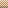

# JavaScript Chess Rendering

This repository contains code to render chess boards as SVG images by using JavaScript. The main benefit is that each chess position you insert into your website requires no network requests (apart from the initial 25K in code).

```
<!DOCTYPE html>
<html>
<head>
.chess-board {
	width: min(50vh, 50vw);
}
</style>
<script src="chess-rendering.js"></script>
</head>
<body>

<chess-board></chess-board>

</body>
</html>

```

The above example results in a simple image of a chess board:


The `<chess-board>` tag is replaced with ``

## Features:

Rendering from a FEN:

```
<chess-board fen='r2qk2r/pp1bbppp/2nppn2/1B4B1/3NP3/2N5/PPP2PPP/R2Q1RK1' ></chess-board>
```


Red/Green Arrows/Highlights:

```
<chess-board fen='r2qk2r/pp1bbppp/2nppn2/1B4B1/3NP3/2N5/PPP2PPP/R2Q1RK1' red-arrows="b7c6" green-arrows="b5c6 d4c6" green-tiles="e2 e3" red-tiles="d2 d3"></chess-board>
```


Marked Tiles:

```
<chess-board fen='1K6/8/4k3/8/8/1P6/8/8 w - - 0 1' green-arrows="b8b7 b7b6 b6b5 b5a4" red-arrows="e6d5 d5d4 d4c3" x-tiles=c4></chess-board>
```


From Black's Perspective:

```
<chess-board black=1>
```



You can also indicate you'd like the result to be an SVG tag rather than an IMG tag:

```
<chess-board svg=1></chess-board>
```

Finally, inline CSS styling is automatically transferred from the `<chess-board>` to the `` tag. The `` tag is also given the class "chess-board".


